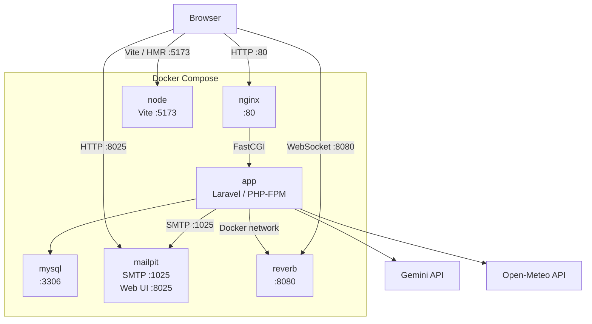

# コーディネート予報

## Overview

コーディネート予報は、天気情報とユーザーが登録したファッションアイテムをもとに、その日の服装選びをサポートするWebアプリケーションです。

当初は、過去のコーディネートを記録し、「以前どのような服装をしたか」を振り返りながら、同じコーディネートの重複を避けるためのコーディネート管理アプリとして開発を開始しました。

開発を進める中で、過去のコーディネートを管理するだけでなく、「その日の天候に合わせて、何を着ればよいか」という服装選びそのものをサポートしたいと考え、天気情報や登録したファッションアイテムを活用した服装提案機能を追加しました。

現在は、以下のような機能を通して、日々の服装選びからコーディネートの記録・共有までをサポートしています。

- **天気に応じた服装提案**
    - 都道府県・市区町村単位で取得した天気情報をもとに、服装選びをサポート
- **AIによる服装アドバイス**
    - 天気情報をもとに、AIが服装に関するアドバイスを生成
- **コーディネート共有**
    - 投稿したコーディネートを他のユーザーと共有
- **ユーザー間のコミュニケーション**
    - コーディネートへのいいね・コメントやフォローを通して、ユーザー同士で交流可能

## Features

- 天気予報の取得
- AIによる服装アドバイス
- ファッションアイテムの登録・管理
- コーディネート投稿
- 着用アイテムの紐付け
- コーディネート検索・おすすめ表示
- ユーザーフォロー
- いいね
- コメント
- 通知
- リアルタイム通知

## Demo

> AWSへのデプロイ後に、公開URLおよびデモアカウントを掲載予定です。

## Tech Stack

| Category       | Technology / Service                             | Version              |
| -------------- | ------------------------------------------------ | -------------------- |
| Frontend       | Vue 3 / Vite / Pinia / Vue Router / Tailwind CSS | —                    |
| Backend        | Laravel / PHP                                    | Laravel 11 / PHP 8.3 |
| Database       | MySQL                                            | 8.0                  |
| Web Server     | Nginx                                            | 1.28-alpine          |
| Realtime       | Laravel Reverb                                   | —                    |
| Mail           | Mailpit                                          | —                    |
| AI             | Gemini API                                       | —                    |
| Weather API    | Open-Meteo API                                   | —                    |
| Container      | Docker / Docker Compose                          | —                    |
| Authentication | Laravel Sanctum                                  | —                    |

## Architecture



### Docker Compose Services

```text
Docker Compose
├── nginx
├── app
├── node
├── mysql
├── mailpit
└── reverb
```

Docker内部のサービス間通信ではComposeのサービス名を使用し、ブラウザからアクセスするサービスではホスト側の`localhost`を使用しています。

特にReverbでは、以下のように通信経路を分けています。

```text
Laravel container ──► reverb:8080
Browser           ──► localhost:8080
```

## Directory Structure

```text
vue-laravel-spa/
├── app/                # Laravel application logic
├── bootstrap/          # Laravel framework bootstrap
├── config/             # Application configuration
├── database/           # Migrations, factories, seeders
├── docker/             # Dockerfiles and Nginx configuration
│   ├── node/
│   ├── nginx/
│   └── php/
├── public/             # Publicly accessible files
├── resources/          # Vue components, CSS, Blade templates
├── routes/             # Application routes
├── tests/              # Automated tests
├── compose.yml         # Docker Compose configuration
├── composer.json       # PHP dependencies
├── package.json        # JavaScript dependencies
├── vite.config.js      # Vite configuration
└── README.md
```

## Environment

- macOS
- Docker
- Docker Compose
- Git

## Setup

### 1. Clone repository

```bash
git clone <repository-url>
cd vue-laravel-spa
```

### 2. Environment variables

Copy the example environment file and configure the required environment variables.

```bash
cp .env.example .env
```

See [Environment Variables](#environment-variables) for details.

### 3. Build containers

```bash
docker compose build
```

### 4. Start containers

```bash
docker compose up -d
```

Check that all containers are running:

```bash
docker compose ps
```

### 5. Install PHP dependencies

```bash
docker compose exec app composer install
```

### 6. Generate application key

```bash
docker compose exec app php artisan key:generate
```

### 7. Initialize the database

For a new development environment:

```bash
docker compose exec app php artisan migrate
docker compose exec app php artisan db:seed
```

See [Database](#database) for details.

### 8. Install JavaScript dependencies

Install JavaScript dependencies inside the Node container:

```bash
docker compose run --rm node npm install
```

The `node` service uses a named volume for `node_modules`, so dependencies are installed for the Linux container environment rather than relying on host-side `node_modules`.

### 9. Access the application

Vite is started automatically by the Node container.

- Application: http://localhost
- Vite development server: http://localhost:5173
- Mailpit: http://localhost:8025

## Database

This application uses MySQL 8.0.

### Migration

After starting the Docker containers, run:

```bash
docker compose exec app php artisan migrate
```

This creates the database tables defined in the Laravel migration files.

### Seeder

To generate the initial development data, run:

```bash
docker compose exec app php artisan db:seed
```

The default `DatabaseSeeder` runs the seeders required for the development environment.

> The SQL dump imported during the original migration from the author's MAMP environment is development data and is not required for a new setup of this repository. A new environment should use `migrate` and `db:seed`.

## Environment Variables

Create `.env` from `.env.example` and set the required values.

### Application

```dotenv
APP_NAME=vue-laravel-spa
APP_ENV=local
APP_DEBUG=true
APP_URL=http://localhost
APP_KEY=
```

Generate the application key after installing the dependencies:

```bash
docker compose exec app php artisan key:generate
```

### Database

The application connects to MySQL through the Docker Compose service name:

```dotenv
DB_CONNECTION=mysql
DB_HOST=mysql
DB_PORT=3306
DB_DATABASE=vue_laravel_spa
DB_USERNAME=your_database_username
DB_PASSWORD=your_database_password
DB_ROOT_PASSWORD=your_database_root_password
```

`DB_USERNAME` and `DB_PASSWORD` are used by Laravel to connect to MySQL, while `DB_ROOT_PASSWORD` is used to configure the MySQL root account in Docker Compose.

### Session / Authentication

For local development:

```dotenv
SESSION_DRIVER=file
SESSION_LIFETIME=120
SESSION_DOMAIN=localhost

SANCTUM_STATEFUL_DOMAINS=localhost
```

### Mail

Mailpit is used as the SMTP server during local development:

```dotenv
MAIL_MAILER=smtp
MAIL_HOST=mailpit
MAIL_PORT=1025
MAIL_USERNAME=null
MAIL_PASSWORD=null
MAIL_ENCRYPTION=null
MAIL_FROM_ADDRESS="noreply@example.com"
MAIL_FROM_NAME="${APP_NAME}"
```

The Mailpit web interface is available at:

http://localhost:8025

### Gemini API

The application uses the Gemini API to generate AI-powered clothing advice.

Add your API key to `.env`:

```dotenv
GEMINI_API_KEY=your_gemini_api_key
```

The API key is not included in the repository and must be obtained separately.

### Laravel Reverb

Laravel Reverb is used for real-time notifications.

Laravel communicates with the Reverb container using the Docker Compose service name:

```dotenv
REVERB_APP_ID=your_reverb_app_id
REVERB_APP_KEY=your_reverb_app_key
REVERB_APP_SECRET=your_reverb_app_secret
REVERB_HOST=reverb
REVERB_PORT=8080
REVERB_SERVER_HOST=0.0.0.0
REVERB_SERVER_PORT=8080
REVERB_SCHEME=http
```

The browser connects to Reverb through the host machine:

```dotenv
VITE_REVERB_APP_KEY="${REVERB_APP_KEY}"
VITE_REVERB_HOST=localhost
VITE_REVERB_PORT="${REVERB_PORT}"
VITE_REVERB_SCHEME="${REVERB_SCHEME}"
```

The different host names are intentional:

- `reverb` is used for communication between Laravel and the Reverb container.
- `localhost` is used for WebSocket connections from the browser.

## Development Commands

### Docker

Build the Docker images:

```bash
docker compose build
```

Start the development environment:

```bash
docker compose up -d
```

Stop the development environment:

```bash
docker compose down
```

Check the status of the containers:

```bash
docker compose ps
```

### PHP / Laravel

Install PHP dependencies:

```bash
docker compose exec app composer install
```

Generate the Laravel application key:

```bash
docker compose exec app php artisan key:generate
```

Clear the application cache:

```bash
docker compose exec app php artisan cache:clear
```

This can be useful when troubleshooting issues such as AI-generated clothing advice not being available after a previous failed request.

### Frontend

Install JavaScript dependencies inside the Node container:

```bash
docker compose run --rm node npm install
```

The Vite development server is started automatically by the Node container when the Docker environment is started.

### Database

Run database migrations:

```bash
docker compose exec app php artisan migrate
```

Seed the database with development data:

```bash
docker compose exec app php artisan db:seed
```

Check the migration status:

```bash
docker compose exec app php artisan migrate:status
```

### Logs

View application container logs:

```bash
docker compose logs -f app
```

Laravel Reverb and the Vite development server are started automatically by their respective Docker Compose services.

## Design / Technical Highlights

### 1. Docker / Docker Composeによる開発環境の構築

**目的**

開発環境による依存関係やバージョン差異を抑え、アプリケーションを再現性の高い環境で開発できるようにするため、Docker / Docker Composeを採用しました。

**技術選定**

Docker Composeを利用し、アプリケーションの実行に必要な複数のサービスをコンテナとして構成しています。

- Laravel / PHP-FPM
- Nginx
- Node.js / Vite
- MySQL
- Mailpit
- Laravel Reverb

**実装上の工夫**

Node.jsの依存関係についてはnamed volumeを利用し、ホスト環境とLinuxコンテナ環境の`node_modules`の差異による問題を避けています。

また、LaravelとReverbなどのコンテナ間通信ではDocker Composeのサービス名を利用し、ブラウザからアクセスするサービスについてはホスト側の`localhost`を利用するよう、通信経路を分離しています。

**得られた効果**

開発に必要な複数のサービスをDocker Composeで一元管理できるため、環境構築や起動手順を簡略化し、開発環境を再現しやすくしました。

### 2. Laravel + Vue 3によるSPA構成

**目的**

ページ全体の再読み込みを減らし、画面遷移やユーザー操作をシームレスに行えるUIを実現するため、Laravel + Vue 3によるSPA構成を採用しました。

**技術選定**

- Laravel：バックエンド / API
- Vue 3：フロントエンド
- Vue Router：SPAのルーティング
- Pinia：フロントエンドの状態管理
- Vite：フロントエンドのビルド・開発サーバー

という形で役割を分離しています。

**実装上の工夫**

Vue 3のComposition APIを利用してコンポーネントやロジックを整理し、Piniaによる状態管理やViteのHMRを活用しています。

また、Laravel Sanctumを利用してLaravelとVue SPA間の認証を行っています。

**得られた効果**

画面全体を再読み込みすることなくページ遷移や各種操作を行えるため、ユーザーが継続的に操作しやすいUIを実現しました。

### 3. Gemini APIとAI機能のフォールバック設計

**目的**

AIによる服装アドバイスをアプリケーションの主要機能の一つとして提供しつつ、外部AI APIの応答失敗によってアプリケーション全体が利用できなくなることを防ぐため、フォールバック処理を実装しました。

**技術選定**

Gemini APIを利用し、天気情報やユーザー情報などをもとに服装に関するアドバイスを生成しています。

**実装上の工夫**

AI APIの利用では、指定する出力内容によってレスポンス生成に失敗するケースがあったため、AIから正常なレスポンスを取得できなかった場合にもアプリケーション側で処理を継続できるようにしました。

AIによるアドバイス生成に失敗した場合は、AI機能が利用できなかったことをユーザーへ通知しつつ、登録されているアイテムを利用したコーディネート提案は引き続き利用できるようにしています。

**得られた効果**

外部AI APIの一時的な障害や応答エラーが発生した場合でも、アプリケーションの主要なコーディネート提案機能まで停止することを防ぎ、サービス全体の可用性を高めています。

### 4. Laravel Reverbによるリアルタイム通知

**目的**

ページを再読み込みすることなく、コメントやいいね、フォローなどによる通知をリアルタイムに受け取れる操作体験を実現するため、Laravel Reverbを導入しました。

**技術選定**

Laravel ReverbによるWebSocket通信を利用し、Laravelから発生した通知イベントをブラウザへリアルタイムに配信しています。

**実装上の工夫**

Docker環境では通信経路が異なるため、接続先を以下のように分けています。

- Laravelコンテナ → `reverb:8080`
- Browser → `localhost:8080`

Laravel側ではDocker Composeのサービス名を利用し、ブラウザ側ではホストマシンからReverbへ接続する構成としました。

**得られた効果**

WebSocketによるリアルタイム通信を実装することで、通知を確認するためにページを再読み込みする必要がなくなり、SPAの操作性を活かしたユーザー体験を実現しました。

### 5. 天気情報を活用した服装提案

**目的**

過去のコーディネートを記録・管理するだけではなく、「その日の天候に合わせて何を着ればよいか」という服装選びそのものをサポートするため、天気情報をコーディネート提案に活用しています。

**技術選定**

Open-Meteo APIから取得した天気情報を利用しています。

取得した天気情報には、気温や降水確率、湿度、風速などが含まれ、これらを服装提案に利用しています。

**実装上の工夫**

取得した天気情報と、ユーザーが登録したファッションアイテムを組み合わせ、季節やシーンなどの条件も考慮しながらコーディネートを提案する構成としています。

また、天気情報を利用した服装提案とGemini APIによるAIアドバイスを組み合わせることで、単純な天気予報の表示だけではなく、その日の服装選びまで支援できるようにしています。

**得られた効果**

「天気を確認する → 自分で服装を考える」という手順を一つのアプリケーション内で完結できるようにし、日々の服装選びをサポートするサービスとしての価値につなげています。

### 6. Laravel SanctumによるSPA認証

**目的**

Laravelをバックエンド、Vue 3をフロントエンドとするSPA構成で、安全かつシンプルにユーザー認証を実装するため、Laravel Sanctumを採用しました。

**技術選定**

Laravel SanctumのSPA認証を利用し、セッションベースの認証を実装しています。

**実装上の工夫**

Docker環境ではCookieのドメイン設定とSanctumのstateful domain設定が重要になるため、`SESSION_DOMAIN`と`SANCTUM_STATEFUL_DOMAINS`をローカル環境に合わせて設定しています。

また、認証情報をJavaScriptから直接扱うトークン方式ではなく、Laravelのセッション認証を利用する構成としています。

**得られた効果**

LaravelとVue SPAの認証をLaravel標準の仕組みに沿って実装し、SPAでありながらセッションベースの認証を利用できる構成としました。

## Troubleshooting

### Vite manifest error

Docker環境構築後、`http://localhost`にアクセスした際に、以下のエラーが発生する場合があります。

```text
Unable to locate file in Vite manifest:
resources/css/app.css
```

これは、BladeテンプレートでCSSファイルをViteのエントリーポイントとして直接指定している一方、Vite側ではCSSをJavaScriptから読み込む構成になっている場合に発生します。

Blade側ではJavaScriptのみをViteのエントリーポイントとして指定します。

```php
@vite(['resources/js/app.js'])
```

CSSは`app.js`から読み込みます。

```javascript
import './bootstrap';
import '../css/app.css';
import '../css/specialColors.css';
```

### Node.js / Rollup dependency error

Docker環境で`npm install`後にViteを起動した際、ホスト環境で生成された`node_modules`との違いにより、Rollupのoptional dependencyに関するエラーが発生する場合があります。

例：

```text
Cannot find module
@rollup/rollup-linux-x64-musl
```

このプロジェクトでは、Docker Composeで`node_modules`をnamed volumeとして管理しています。

依存関係をコンテナ内で再インストールすることで解決できます。

```bash
docker compose run --rm node npm install
```

### Sanctum authentication error

ログイン後に、

```text
GET /api/user
401 Unauthorized
```

となる場合は、Cookieのドメイン設定とSanctumのstateful domain設定を確認してください。

ローカルのDocker環境では、以下の設定を使用します。

```dotenv
SESSION_DOMAIN=localhost
SANCTUM_STATEFUL_DOMAINS=localhost
```

設定変更後、必要に応じてLaravelの設定キャッシュをクリアしてください。

```bash
docker compose exec app php artisan config:clear
```

## Future Improvements

- **服装アドバイス・アイテム提案UIの改善**
    - AIによる服装アドバイスとアイテム提案について、より直感的に内容を確認できるよう、レイアウトや情報の見せ方を改善する。
- **コメント機能のリアルタイム更新**
    - 現在はコメント投稿時の通知をLaravel Reverbでリアルタイムに受信できる一方、コメント一覧自体はリアルタイムには更新されない。
    - WebSocketを活用し、他のユーザーによるコメント投稿をコメント一覧にも即時反映できるよう改善する。
- **コーディネートの非公開機能**
    - 投稿したコーディネートを公開・非公開から選択できるようにする。
- **AWSへのデプロイ**
    - 本番環境をAWS上に構築し、公開環境として提供する。

## Author

**KEN TAKAHARA**

- GitHub: [GitHub username](https://github.com/...)
- X: [@xxxxxx](https://x.com/...)
